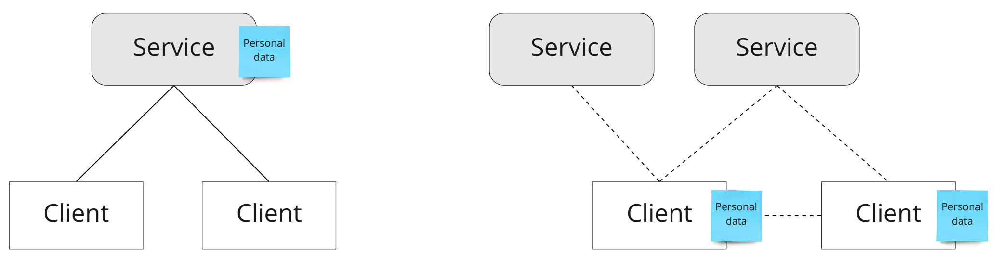
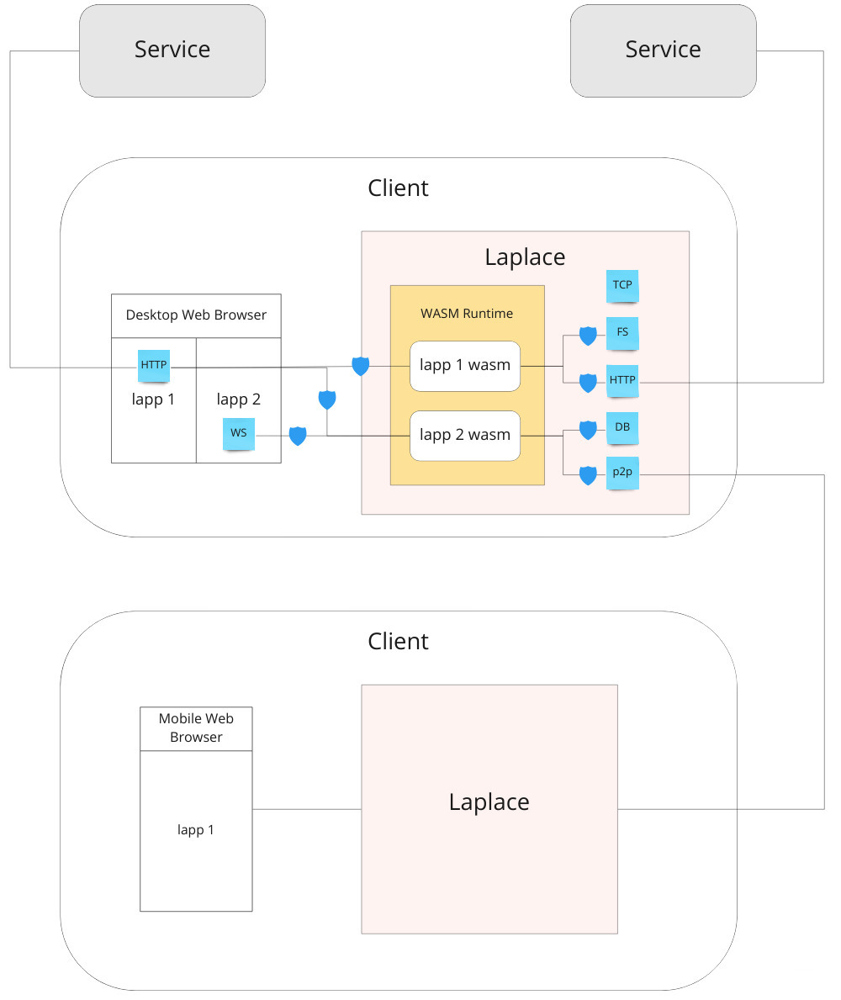

# Laplace

The local-first web-application platform for the decentralized web.

Look at the traditional centralized web-applications architecture vs. the local-first web-applications architecture:


The Laplace high-level architecture is shown in the diagram below:


## Build

Building Laplace requires the latest `stable` and `nightly` Rust toolchains, the `wasm32` targets and `cargo-make` and
`wasm-bindgen` build tools.

To install Rust and its toolchains/targets via [rustup](https://rustup.rs/), if it is not already installed, run:

```shell
curl --proto '=https' --tlsv1.2 -sSf https://sh.rustup.rs | sh
source $HOME/.cargo/env

rustup toolchain install stable nightly
rustup target add wasm32-unknown-unknown --toolchain stable
rustup target add wasm32-wasi --toolchain nightly
```

To install [cargo-make](https://github.com/sagiegurari/cargo-make) and
[wasm-bindgen](https://github.com/rustwasm/wasm-bindgen), run:

```shell
cargo install --force cargo-make wasm-bindgen-cli
```

To build Laplace and all examples, run:

```shell
cargo +stable make all
```

Or for a debug build, run:

```shell
cargo +stable make all -p debug
```

## Run examples

Run the Laplace server:

```shell
cargo +stable make run
```

Or for a debug build:

```shell
cargo +stable make run -p debug
```

Then visit [http://localhost:8080](http://localhost:8080). If you are running for the first time or the previous link
did not work, then visit [http://localhost:8080/?access_token=24tpHRcbGKGYFGMYq66G3hfH8GQEYGTysXqiJyaCy9eR](http://localhost:8080/?access_token=24tpHRcbGKGYFGMYq66G3hfH8GQEYGTysXqiJyaCy9eR).
You can change the default port, access token and other settings by editing `settings.toml` file.

## Development notes

To check the project, use the following command:

```shell script
cargo +stable check --workspace --all-features --all-targets
```

To run all tests, use the following command:

```shell script
cargo +stable test --all-features --all-targets
```

To check and perform formatting, use the following commands:

```shell script
cargo +nightly fmt --check
cargo +nightly fmt
```

To enable autoformatting for IntelliJ IDEA with the Rust plugin:

`File -> Settings -> Languages & Frameworks -> Rust -> Rustfmt, check "Run rustfmt on Save"`

To run clippy, use the following command:

```shell script
cargo +stable clippy --all-targets --all-features -- -D warnings
```

To setup git hook, use the following command:

```shell script
cp .git-pre-push.sh .git/hooks/pre-push
```
